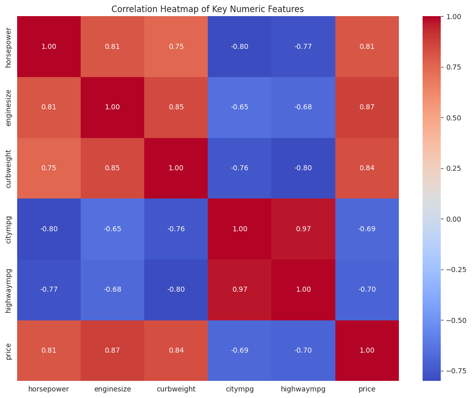
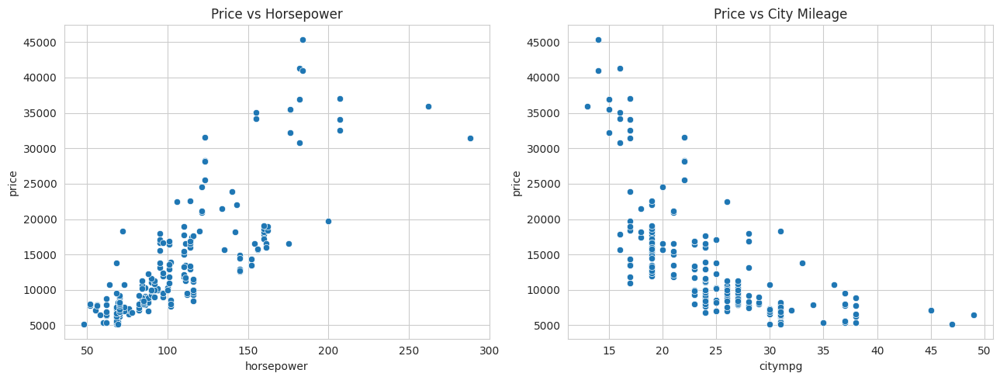
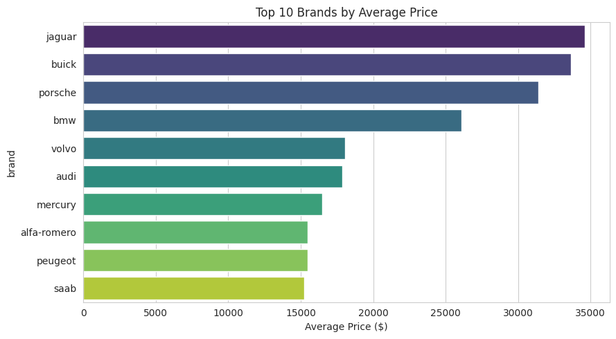
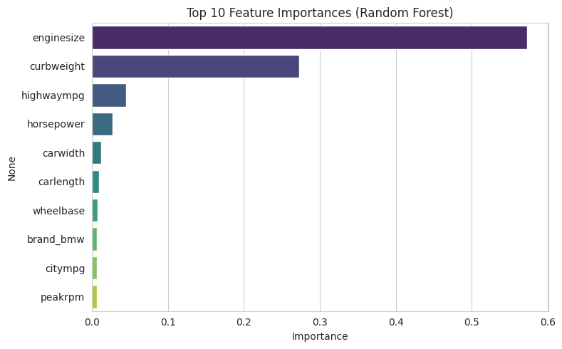

# Car Price Prediction with Machine Learning

## About
This project was completed as part of my Data Science internship at CodeAlpha.

## Problem Statement
Predict car selling prices based on features like brand, horsepower, engine size, mileage, and body type.

## Dataset
205 cars, 25 original features including brand, horsepower, engine size, curb weight, fuel type, body type, and mileage (city/highway mpg). No missing values.

## Approach
- Data loading and exploration
- Feature engineering: extracted brand name from full car name (representing brand goodwill), cleaned inconsistent brand spellings
- One-hot encoded categorical features (fuel type, body type, drive wheel, engine type, etc.)
- EDA: correlation heatmap, price vs horsepower/mileage scatter plots, average price by brand
- Trained and compared Linear Regression and Random Forest Regressor
- Evaluated with R², MAE, and RMSE

## Results
- Linear Regression: R² = 0.9097, MAE = $1,763.57, RMSE = $2,669.93
- **Random Forest: R² = 0.9595, MAE = $1,248.12, RMSE = $1,786.98 (best model)**
- Engine size, curb weight, and horsepower were the strongest price predictors

## Tools Used
Python, pandas, scikit-learn, matplotlib, seaborn

## How to Run
1. Clone this repo
2. Install requirements: `pip install -r requirements.txt`
3. Open `notebook/car_price_prediction.ipynb` in Jupyter or Google Colab
4. Run all cells

## Video Explanation
[Add your LinkedIn video link here after posting]
